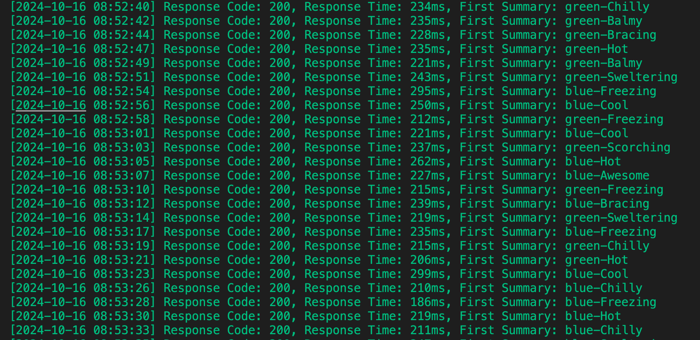

# Web Api Container App demo

This application is an example web api that has been containerized so it can be deployed into a Azure Container App, Azure App Service, or AKS depending on which pipeline you would like to use.  It is also created as an example of following deployment best practices for [continuously deployment of containers](https://learn.microsoft.com/en-us/azure/app-service/deploy-best-practices#continuously-deploy-containers).

## Description

This project was created initially by using the sample todo .Net web api from the Microsoft learn site:  [Create web API using ASP.NET Core](https://learn.microsoft.com/en-us/aspnet/core/tutorials/first-web-api?view=aspnetcore-6.0&tabs=visual-studio-code).  Multiple controllers have been added so here is a quick definition of each:
- TodoController
  - InMemory representation of a database to store the `TodoItemDTO` object.  The api supports the basic CRUD operations.
- WeatherForecastController
  - Returns a hard coded weather forecast as an enumerable that can be used for testing.
- ConfigController
  - Sample Azure App Configuration implementation that I like to have around to refer back to.  Please check here if you would like more info on [Azure App Configuration](https://learn.microsoft.com/en-us/azure/azure-app-configuration/overview)

There is also a Dockerfile as part of this project that is used to containerize the app and push it up to Azure Container Registry(ACR).  Once the image is in ACR, it then creates/updates the Azure Container App for the demo web api.  All of this is done in the `deploy-package.yml` GitHub actions workflow.  See workflow section below for more specifics on the workflow.

## Badges

| Workflow Name     | Badge |
| ----------- | ----------- |
| Azure Container App Deployment |  |
| Azure App Service Deployment |  |
| Azure App Service Slot Deployment |  |
| Azure Kubernetes Service (AKS) Deployment   |         |

## How to use

This is meant to be a repo that you can clone and use as you like.  The only thing you will need to change is the variables in the `deploy-package.yml` workflow.  They will be in the `env` section of the workflow.  There will need to change to match the resource names you would like to use in your Azure Subscription.

### Requirements

- **Azure Subscription**
- **This repo cloned in your own GitHub repo**
- **Create an appsettings.Development.json file and fill out with the structure from appsettings.json**
- **Service principle with contributor access to the subscription created as a GitHub Secret**
  - This is only so you can create your resource group at the subscription level, if you don't want to give your service principle that kind of access you will need to have another way to create the resource group and then you can remove that step from the workflow
  - The credentials for this service principle need to be stored according to this document:  [Service Principal Secret](https://learn.microsoft.com/en-us/azure/developer/github/connect-from-azure?tabs=azure-portal%2Clinux#use-the-azure-login-action-with-a-service-principal-secret)
  - I have used the name `AZURE_CREDENTIALS` for the secret
  - ==For the AKS and App Server deployment== you will need to have write permission which is greater than Contributor because these bicep files are assigning a role to the underlying service principal so you can pull the image from the registry in the app service and you can enable the AKS cluster to communicate with the registry and perform kubectl commands.  For my purposes I assigned `User Access Administrator` role to the service principal running the pipeline.
- **Azure App Configuration resource**
  - **This is optional and only needed if you want to call the ConfigController**
  - Add the following configuration settings
    - | Key     | Value | Label |
        | ----------- | ----------- | -- |
        |TestAp:Settings:Message|DEV - Data from Azure App Configuration | dev |
        |TestAp:Settings:Message|TEST - Data from Azure App Configuration | test |
        |TestAp:Settings:Sentinel|1 |  |
        |TestAp:<oid for user 1>:Sentinel|ConnectionStringForUser1 |  |
        |TestAp:<oid for user 2>:Sentinel|ConnectionStringForUser2 |  |
    \* `<oid for user 1>` and `<oid for user 2>` should be replaced with the actual Object IDs for the users. This is used in the ConfigController.cs to show how to get a different connectionstring at runtime based on the logged in user
  - Create a managed identity and grant it `App Configuration Data Reader` on the Azure App Configuration Access Control so it will be able to read the values.

## GitHub Workflows

There are a few workflows used by this project to demonstrate the different ways and resources you can deploy to.  Currently there are examples for an App Service, Azure Container App, and Azure Kubernetes Service (AKS).

### `deploy-aca-package.yml`

The workflow will deploy everything it needs to a given resource group and into an Azure Container App.  It has 4 separate stages: expose-env, build-infra, build, deploy

1. expose-env
    - Unfortunately you need to expose the environment variables that you want to use as output variables so they can be passed into the shared workflow. Ideally it would be nice if you could just use the standard `env` variables
2. build-infra
    - Uses a shared workflow that accepts the variables that were exposed as environment variables in the first stage to create the required infrastructure you need for Azure Container Apps.  These actions are idempotent so they can be run multiple times.
    - The shared workflow is just an example of what you might want to do for your organization to keep things consistent.
3. build
    - Builds the container and tags the image
4. deploy
    - Uses the container image that was built and pushed to ACR and creates/updates that container app with that newly built image. There is [another repo](https://github.com/anotherRedbeard/blazor-demo-container) that contains a UI (Blazor client app) that will call this `todo`.  There is a reference here to that client UI to get the URI that can be added to CORS. If it doesn't exist it will add `*`.

### `deploy-aks-package.yml`

The workflow is using bicep templates to create everything it needs for an AKS cluster into a given resource group.  It has 3 separate stages: buildInfra, buildImage, deploy

1. buildInfra
    - Uses azure credentials to create a resource group via the `az cli` and then calls the `az deployment group create` command to deploy the bicep templates that are stored in the `./iac/` folder.  This will create all the infrastructure you need to support this demo api implementation for AKS.  These actions are idempotent so they can be run multiple times.
2. buildImage
    - Builds the container and tags the image
3. deploy
    - While this repo is only for the `todo` api, there is [another repo](https://github.com/anotherRedbeard/blazor-demo-container) that creates a UI (Blazor client app) that connects to this todo api. The first part of this stage is to get that URL so we can add it to the CORS list.
    - Next we use a `sed` script to replace variables in the AKS deployment file so it can be dynamic to use the container image we just built.
    - Finally we use the deployment file to setup the deployment in AKS

### `deploy-app-service.yml`

The workflow is using bicep templates to create everything it needs for an App services container deployment for this API. It has 2 separate stages: build-infra, build-deploy

1. build-infra
    - Uses azure credentials to create a resource group via the `az cli` and then calls the `az deployment group create` command to deploy the bicep templates that are stored in the `./iac/` folder.  This will create all the infrastructure you need to support this demo api implementation for Azure app service.  These actions are idempotent so they can be run multiple times.
2. build-deploy
    - Builds the container, tags the image, and deploys it to container registry.
    - Deploys the container to the app service and sets up the config so it can get the image again for scaling and failures.

### `deploy-app-service-image-only.yml`

The workflow deploys a new version of the code to a container, pushes it to the registry and then updates the app service 'stage' slot with the new image revision.  This assumes that all of the infrastructure is already in place (see previous workflow `deploy-app-service.yml`) and it meant to demonstrate [slot deployments](https://learn.microsoft.com/en-us/azure/app-service/deploy-staging-slots?tabs=portal) for zero downtime on your app service. It has 2 separate stages: build-deploy, swap-slot

1. build-deploy
    - Builds the container, tags the image, and deploys it to container registry.
    - Deploys the container to the app service
2. swap-slot
    - Uses the environment parameter to ensure that a manual approval can be done before swapping the slots
    - Swaps the stage slot to the production slot once it has been approved

In order to test this, there is a `monitor-api.sh` file that can be used to ping the api every 2 seconds to show how the latency isn't impacted by just swapping the slots. If you want, you can create a copy of the `monitor-api.sh` file into an environment specific file `monitor-api.dev.sh` that is ignored by the `.gitignore` file. Here is an example output that shows the response changes from being prefixed with 'green' and then swapped to be prefixed with 'blue':

